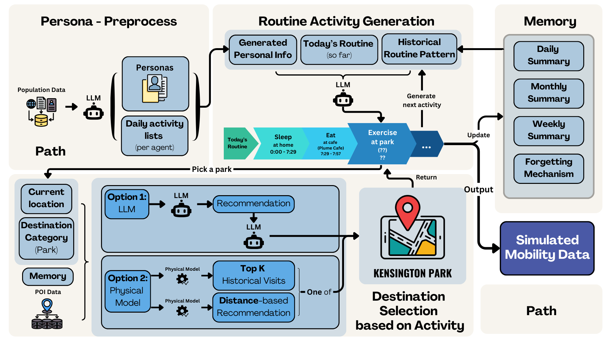

# TrajLLM - A LLM-Empowered Agent-Based Human Mobility Simulation Framework

[](https://doi.org/10.5281/zenodo.14885828)

## 📜 Description
This is the repository for **TrajLLM**. The framework leverages LLMs in realistic human mobility data generation. It consists 4 modules: **persona**, **activity**, **destination** and **memory**.

For demonstration purpose, [Foursquare check-in dataset from Tokyo](https://www.kaggle.com/datasets/chetanism/foursquare-nyc-and-tokyo-checkin-dataset) is being used as the underlying POI dataset.

<p align="center">

  <br>
  <em>Figure 1: The overall pipeline for TrajLLM.</em>
</p>

## 🏅 Key Features
- `gen_persona.py`: Generate personas and corresponding daily activity lists according to real-world population statistics.
- `simulate.py`: Simulate daily routines based on generated personas
- `mem_module.py`: 
- `app.py`: This is the frontend design for demonstration purpose.

## 🍳 Usage
Once enter the openai api key in `./helper/utils.py` and `./mem_module`, the following commands can be used to get started.

### Persona generation (pre-process)
```
Usage:
    python gen_persona.py [options]

Options:
    -n, --number <int>  Set amount of personas to generate, default=1, which generate 5 personas
    -p, --persona       Generate personas without activity list or any loc info
    -a, --activity      Only generate activity list for existing personas
    -u, --p_update      Only update loc info of home, workplace and/or school for existing personas
    -l, --llm <model>   Specify the model type to use: 'llama' or 'gpt', default='gpt'
```

The generated personas and daily activity lists will be stored in `./res/personas.json` and `./res/activities.json`.

Example usage:
```bash
python gen_persona.py -n 10 # which generate 50 personas with their daily activitiy lists
```

### Trajectory Simulation
```
Usage:
    python simulate.py [options]

Options:
    -d, --date <dd-mm-yyyy>   Set the simulation start date
    -n, --number <int>        Number of days to simulate
    -m, --model <dest_model>  Set the destination selection model to be 'physical', 'physicl_mix'(involve topk stratge) or 'llm', default='physical_mix'
    -l, --llm <model>         Specify the model type to use: 'llama' or 'gpt', default='gpt'
```

The generated trajectories will be stored as `./res/routine_dd-mm-yyyy_<persona index>.json`.

Example usage:
```bash
python simulate.py -d 17-11-2024
```

## 🚀 Demonstration
To run the frontend to visualise the generated trajectories, use the following command:
```bash
python app.py
```

Notice that `ROUTINE_DIR` in `./app.py` can be modified to visualise other newly generated trajectories.
# Human-Trajectory-semantic-Interpreter
